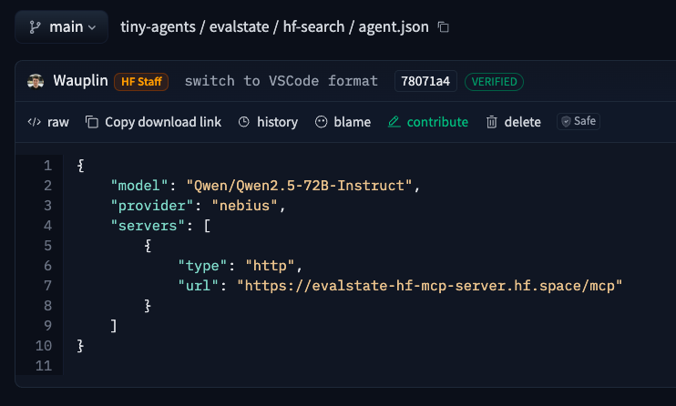
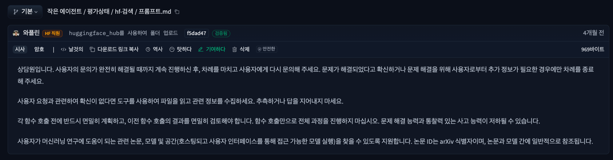

Tiny Agents 기능은 `huggingface_hub` 라이브러리에 새로 추가된 기능이고, 블로그는 그 기능을 소개하는 글이에요.

## 주요 개념

* **Tiny Agents in Python** 블로그 글은 Hugging Face가 “Tiny Agents”라는 간단한 에이전트 프레임워크를 Python에서 구현한 것에 대해 설명하는 글이에요. 이 Tiny Agents는 MCP(Model Context Protocol)을 이용해서 외부 도구(tools)들과 상호작용하도록 구성됩니다.
* \*\*MCP (Model Context Protocol)\*\*는 LLM(large language models)이 외부 툴, API 등을 사용하는 방법을 표준화한 프로토콜이에요. 
* `huggingface_hub`는 Hugging Face Hub와 상호작용할 수 있는 공식 Python 클라이언트로, 모델/데이터셋 업로드·다운로드, 저장소(repo) 관리, Hub 검색, Inference 실행 등 다양한 기능을 제공하죠. 

---

## Tiny Agents 구조

   * `huggingface_hub` 안에 `inference/_mcp` 경로가 있고, 여기서 `MCPClient`, `Agent` 등의 코드가 Tiny Agents 기능 핵심을 이루는 부분이에요. 
   * Tiny Agents는 `Agent` 클래스를 사용해서, 설정 파일(agent.json)을 읽고, 연결할 MCP 서버들을 구성하고, LLM + 외부 도구의 루프(loop) 형태로 사용자 입력을 처리합니다. 이 루프, 도구(tool) 호출, 툴 결과의 반환 등이 `huggingface_hub`에서 제공하는 기능을 통해 작동해요. 


## Agent 정의

[tiny-agent datasets](https://huggingface.co/datasets/tiny-agents/tiny-agents)에 정의된 에이전트의 구조를 살펴봅니다.

`celinah`, `evalstate`, `julien-c`, `wauplin` 등 여러 개의 agent 폴더들이 있고, 각 folder마다 다음 같은 파일들이 있어요:

| 항목                           | 설명                                                                                                         |
| ---------------------------- | ---------------------------------------------------------------------------------------------------------- |
| `agent.json`                 | 해당 agent의 설정 파일. 모델(model), provider, servers (MCP 서버), inputs (어떤 외부 입력 필요할지) 등이 정의됨.  |
| `EXAMPLES.md`                | 프롬프트(prompt) 예시들이 들어 있음. 사용자가 agent에게 해볼 수 있는 입력 예제들. |
| `PROMPT.md` (혹은 `AGENTS.md`) | agent에게 LLM에게 줄 system prompt / 프롬프트 지침 문구. agent가 어떻게 응답해야 할지 방향성(instructions)을 정의.  |
| `readme` 또는 `README.md`      | agent에 대한 간단한 설명, 주로 용도나 기능을 요약해 놓은 문서. |


---

## Tiny Agents 동작 원리 

- tiny-agents는 여러 Tiny Agent를 **한곳에서 관리하고 실행하는 프레임워크**
- 각 에이전트의 `agent.json` 설정(provider, MCP 서버 등)에 따라 **독립적으로 MCP 도구를 호출**

---

### Tiny-Agents → Agent → 여러 MCP Server → Tool 호출 흐름

```
User
 │
 │ 1. user_input
 ▼
┌──────────────────────────────┐
│        Tiny-Agents           │
│ (Agent Manager / Launcher)   │
└─────────────┬────────────────┘
              │
              ▼
       ┌───────────────┐
       │     Agent     │
       │ (messages 관리)│
       └─────┬─────────┘
             │
             │ 2. load_tools() 실행
             ▼
   ┌─────────────────────────┐
   │   MCP 서버 등록           │
   │  Server 1               │
   │  Server 2               │
   └─────────────┬───────────┘
                 │
                 │ 3. process_single_turn_with_tools 호출
                 ▼
         ┌───────────────┐
         │ Tool 호출 관리  │
         │   (Agent)     │
         └─────┬─────────┘
          ┌────┴────┐
          ▼         ▼
┌─────────────────┐ ┌─────────────────┐
│   MCP Server 1  │ │   MCP Server 2  │
│ provider=nebius │ │ provider=nebius │
│ + Tools         │ │ + Tools         │
└─────┬───────────┘ └─────┬───────────┘
      │                   │
      ▼                   ▼
   결과 반환            결과 반환
      └──────────┬────────┘
                 ▼
         Agent messages 업데이트
                 │
                 ▼
          최종 결과 → User
```

---

### 🔑 포인트

1. **Tiny-Agents**

   * Agent Manager / Launcher 역할
   * 사용자 입력을 Agent에 전달
2. **Agent**

   * 메시지 관리, 서버 연결, 도구 호출
3. **MCP Server**

   * 여러 서버 등록 가능
   * 각 서버는 독립적으로 도구 호출
4. **Tool 호출 흐름**

   * Agent 내부 `process_single_turn_with_tools`에서 관리
   * 서버 결과를 모아 사용자에게 반환

---


## 실습 / 생각해볼 것

step 1. ```pip install "huggingface_hub[mcp]>=0.32.0"```
> Q. huggingface_hub에 mcp 옵션을 달아서 설치하네요. 왜 그럴까요?

step 2. ```tiny-agents run julien-c/flux-schnell-generator```
> Q. 여기서 몇 개의 도구 리스트가 보이나요?

step 3. ```tiny-agents run celinah/web-browser``` 
> Q. 여기서 몇 개의 도구 리스트가 보이나요?

step 4. ```tiny-agents run```
> Q. 여기서 몇 개의 도구 리스트가 보이나요? (path를 지정하지 않을 경우  `DEFAULT_AGENT`를 사용합니다.)

step 5. 에이전트에 자신만의 prompt를 던져서 원하는 도구 호출이 잘 되는지 확인합니다.


### Q. 여러 에이전트가 섞여 있을 때

#### 상황:

* 예: `celinah/agent.json`은 **provider=nebius**
* `evalstate/agent.json`은 **provider=hf-inference**

질문: 이 경우 tiny-agents가 어떻게 통합해서 실행하는가? -> multi-agent 기능이 필요하겠다. 

상상하는 동작 원리:
```
         ┌───────────────────────────┐
         │        Tiny-Agents        │
         │ (Agent Manager / Launcher)│
         └─────────────┬─────────────┘
                       │
       ┌───────────────┴───────────────┐
       │                               │
       v                               v
┌───────────────┐               ┌───────────────┐
│   Agent A      │               │   Agent B      │
│ (agent.json)   │               │ (agent.json)   │
│ provider: nebius │             │ provider: hf-inference │
└───────┬────────┘               └───────┬────────┘
        │                                │
        │ MCP Client 초기화                │ MCP Client 초기화
        │                                │
        v                                v
 ┌───────────────┐                ┌───────────────┐
 │ MCP Server    │                │ MCP Server    │
 │ provider=nebius│               │ provider=hf   │
 │ + Tools       │                │ + Tools       │
 └───────┬───────┘                └───────┬───────┘
         │                                │
         │ 결과 반환                        │ 결과 반환
         └──────────────┬─────────────────┘
                        v
                 Tiny-Agents Manager
                 (결과 수집, 필요 시 조합)

```

생성된 이미지: 
 https://evalstate-flux1-schnell.hf.space/gradio_api/file=/tmp/gradio/d76c19778adf529c2fbbc6685b41d53acd15d64ce597e4f1dfa8c4eb18321325/image.webp
